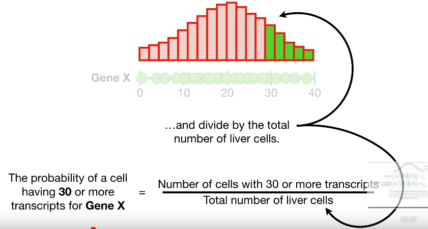
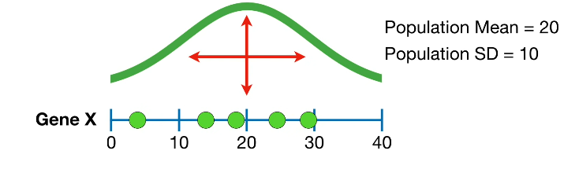

# Histograms

reference - https://youtu.be/qBigTkBLU6g

---

Imagine we measured somewhere and then we this tall and we measured someone....and we measured a whole bunch of people.

We could try to make it easier to see hidden measurements by stacking any that are exactly the same but measurements that are exact same are rare, and a lot of the hidden measurements are still hidden.

This is a histogram. The taller the  stack within a bin, the more measurements we made that fall into that bin.

---

# Probability Distributions

reference - https://youtu.be/oI3hZJqXJuc

---

# The Normal Distribution

reference - https://www.youtube.com/watch?v=rzFX5NWojp0

---

 

***Normal or Gaussian distribution (bell shaped curve)***

The y-axis represents the relative probability of observing someone who is really short, or really tall, or who has an average height.

 

Just looking at the graph, we can tell that there is a high probability that a newborn baby will be between 19 and 21 inches tall.
In contrast, adults are between 60 and 80 inches tall.
The curve for babies is way tall compared to the curve for adults. This is because there are more possibilities for adult height than for babies. The more options there are for height, the less likely any specific measurement will be one of them. 
***The Width of the curve is defined by the standard deviation.***
By looking at the curves that babies have a relatively small standard deviation compared to adults.
The standard deviation for babies is 0.6. The standard deviation for adults is 4.
Knowing the standard deviation is helpful because normal curve are drawn such that 95% of the measurements fall between +/- 2 standard deviations around the mean.
This  means that 95% of the baby measurements fall between 20 +/- 1.2 inches. And 95% of the adult measurements fall between 70 +/- 8 inches.

 

### To draw a normal distribution, you need to know:

1. The average measurement. This tells us where the center of the curve goes.
2. The standard deviation of the measurements, this tells us how wide the curve should be. And the width of the curve determines how tall it is. The wider the curve, the shorter. The narrow the curve, the taller.

 

---

# Poplulation and Estimated Parameters

reference - https://youtu.be/vikkiwjQqfU

---

We could count the number of mRNA transcript for GeneX in every single cell. Imagine 240 billion green dots on this line represents the 240 billion cells in human liver. We can draw  a histogram of this measurement.

Histogram tells us that most of the cells had between 20 and 30 mRNA transcripts and relatively few cells had less than 10 transcripts or more than 30 transcripts.

The mean, 20 is right in the middle and the standard deviation 10, corresponds to how wide the curve is around the mean. ***The standard deviation tells us how the data are spread around the mean***. 

Histogram represents every liver cell, or all the grocery stores in a specific chain, a statistician would say that it represents a population. Thus, the mean and standard deviation of the normal curve, which represents the population, are called population parameters. We call the mean the population mean and the standard deviation the population standard  deviation.

We almost always estimate the population parameters using relatively small sample. In this case, we have measurements from only 5 of the 240 billion cells so we will use these 5 measurements to estimate the population parameters. The reason why we want to know the population parameters is to ensure that the results drawn from our experiment are reproducible. In other words, if someone else measured Gene X in 5 different liver cells then they get five different measurements. However, the new measurements  will come from the same population and insights derived from the population, like the probability of observing more that 30 mRNA transcripts in a single cell, will apply to both experiments or any future experiments. So instead of just describing  the 5 measurements that we made, we want to estimate the population parameters and use those as the basis for the results.
It might be helpful to think these 5 measurements as the training data set and the curve that represents the population is what we want to predict.

The more data that we have, the more confidence we can have in accuracy of the estimates. One of the main goals in statistics is how much confidence we can have in population estimates. Statisticians always calculate p-values and confidence intervals to quantify the confidence in the estimated parameters.

---

# Statistics Fundamentals - Estimating the Mean, Variance and Standard Deviation.

reference - https://youtu.be/SzZ6GpcfoQY

---

If we want to fit a normal curve to a histogram then we need to calculate the population mean and the population variance, or population variance, or population standard deviation.

Population mean(myu) = average of all the measurements.

Estimate population mean (sample mean(x bar)) =  average of the measuremnts collected.

with more and more data estimated population mean gets closer and closer to the population mean.

To determine how wide to make the curve by calculating the variance and standard deviation.

Instead if we estimated the population variance  and population standard deviation from the relatively small number of measurements that we have.

---