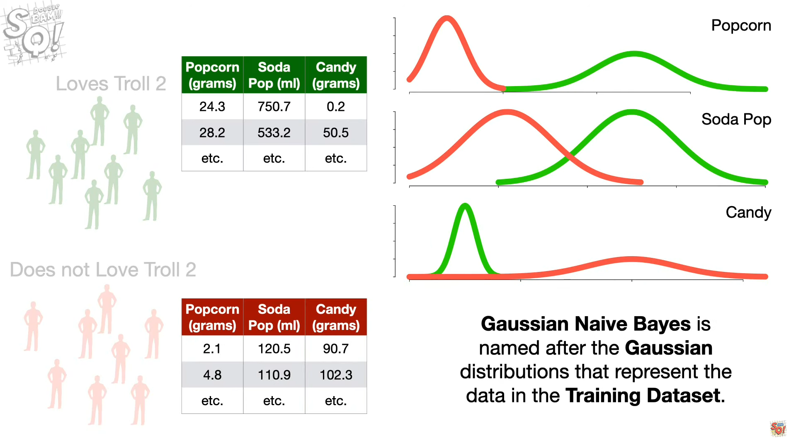
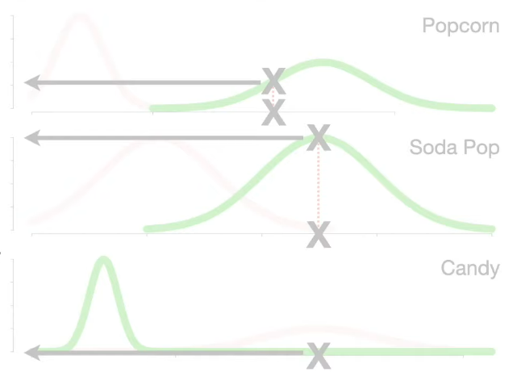
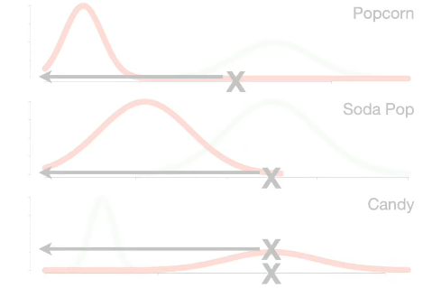

# Naive Bayes Classification algorithm Basics (Notes)


### Multinomial naive bayes classifier

Reference ->https://youtu.be/O2L2Uv9pdDA


---
### Example - filter spam emails or messages

---

<br>

We can use the histogram to calculate the probabilities of seeing each word, given that it was a normal message.

```

Normal Message

Dear   --------  P(Dear|N)   = 0.47       
Friend -----     P(Friend|N) = 0.29
Lunch  ---       P(Lunch|N)  = 0.18
Money  -         P(Money|N)  = 0.06

Probability(Dear|Normal) = 8/17 = 0.47
Probability(Friend|Normal) = 5/17 = 0.29
Probability(Lunch|Normal) = 3/17 = 0.18
Probabiltiy(Money|Normal) = 1/17 = 0.06

Spam Message

Dear   --        P(Dear|S)   = 0.29
Friend -         P(Friend|S) = 0.14
Lunch            P(Lunch|S)  = 0
Money  ----      P(Money|S)  = 0.57

Probability(Dear|Spam) = 2/7 = 0.29
Probability(Friend|Spam) = 1/7 = 0.14
Probability(Lunch|Spam) = 1/7 = 0
Probabiltiy(Money|Spam) = 4/7 = 0.57

```
     
We calculated the  probabilities of discrete, individual words, and not the probability of something continuous, like weight or height,these Probabilities are also called Likelihoods.

---
New message = "Dear Friend"\
Consider there are 12 messages = 8 of Normal + 4 of Spam in total,
 
Since 8 of the 12 messages are normal messages, out initial guess will be 0.67.\

P(N) = 8/(8+4) = 0.67
    
The initial guess that we observe a Normal message is called a Prior Probability.
    
```P(N) x P(Dear|N) x P(Friend|N) = 0.67 x 0.47 x 0.29 = 0.09```
We can think of 0.09 as the score that the Dear Friend gets if it is a Normal Message. But its proportional to the probability, P(N|Dear Friend). i.e.
```0.09 is proportional to P(N|Dear Friend)```

P(S) = 4/(8+4) = 0.03

```P(S) x P(Dear|S) x P(Friend|S) = 0.03 x 0.29 x 0.14 = 0.01```

Technically it is proportional to the probabiltiy that the message is spam given that it says Dear Friend.

```0.01 is proportional to P(S|Dear Friend)```

Because the score we got for Normal Message is 0.09 is greater than the score we got for Spam Message that is 0.01, We can decide that the dear friend is a normal message.

<br>

### What we did ?

<br>

1. We started with histograms of all the words in the normal messages and all of the messages  in the spam.
2. We calculated the probabilities of seeing each word, given that we saw the word in either a normal message or spam.
3. Then we made an initial guess about seeing a normal message. This guess can be anything between 0 and 1, but we based ours on the classifications in the Training Dataset. Then we made the same sort of guess about the probability of seeing spam.
4. Then we multiplied our initial guess that the message was normal by the probabilities of seeing the words, Dear and Friend, given that the message was normal. Then we multiplied our initial guess that the message was a spam by the probabilities of seeing the word Dear and Friend, given that the message was spam.
5. Then we did the math and decided that Dear FFriend was a normal message because 0.09 > 0.01.


<br>

---

New message = "Lunch Money Money Money Money"

This money contains the word Money four times and since the probability of seeing the word Money is much higher in spam (0.56) than in normal messages (0.06) then it seems reasonable to predict that this message will endup being spam.

1. Calculating the score for a normal message.

   ```P(N) x P(Lunch|N) x P(Money|N)^4 = 0.000002```

2. Calculating the score for a spam message.

   ```
     P(S) x P(Lunch|S) x P(Money|S)^4 = 0
   = P(S) x 0 x P(Money|S)^4 = 0
   
   ```

since probability of seeing lunch in spam was 0 in training data. Then it doesnt matter what value we picked for the initial guess that the message was spam and it doesn't matter what the probability is that we see Money given that the message was spam. In other words, if a message contains the word Lunch, it will not be classified as spam and that means we will always classify the messages with Lunch in them as Normal, no matter how many times we see the word Money. And that's a problem.

To Work around this problem, people usually add 1 count, represented by a black box, to each word in the histograms.

```
Normal Message
  
Dear   --------=      
Friend ----=     
Lunch  ---=       
Money  -=         

Spam Message

Dear   --=       
Friend -=         
Lunch  =          
Money  ----=      

```
The number of counts we add to each word is typically refered to with the Greek letter alpha. In this case alpha = 1, but we could set it to anything. Anyway, now we calculate the probabilities of observing each word, we never get 0.

The probability of seeing Lunch : 

```P(Lunch|Spam) = 1/(7+4) = 0.09```

Adding counts to each word does not change our initial guess that a message is normal, P(N) or the initial guess that a mesasage is spam, P(S) because adding a count to each word did not change the number of messages in the Training Dataser that are normal (8) or the number of messages that are spam (4).

Now, when we calculate the scores for this message,

```
P(N) x P(Lunch|N) x P(Money|N)^4 = 0.0001
P(S) x P(Lunch|S) x P(Money|S)^4 = 0.00122

0.00122 > 0.0001
```

Since the value for spam is greater than the one for a normal message we classify the message as spam!!!.

---

### Why Naive Bayes is naive ????

naive -  showing a lack of experience, wisdom, or judgement.

<br>

The thing that makes Naive Bayes so naive is that ut treats all word orders the same.

For example, the Normal message score for the phrase, Dear Friend  (0.08) is the exact same as the score for Friend Dear (0.08). In regardless of how the words are ordered, we get 0.08.

Naive Bayes treats language like its just a bag full of words and each message is random handul of them.

Naive Bayes has high bias but it has low variance.

---
---

## Gaussian naive bayes 

Reference ->https://youtu.be/H3EjCKtlVog

---


### Imagine we wanted to predict if someone would love the 1990 movie Troll 2 or not.

---

We collected data from people who loves troll two and from people who doest love troll 2.

We measured the amount of popcorn they ate each day, how much soda pop they drank and how much candy they ate.

```
Loves Troll 2

     Popcorn(grams)    Soda Pop (ml)    Candy(grams)

     24.3              750.7            0.2
     28.2              533.2            50.5
     etc.              etc.             etc.

mean 24               something       something
SD   4                something       something


Does not Love Troll 2

     Popcorn(grams)    Soda Pop (ml)    Candy(grams)

     2.1               120.5            90.7
     4.8               110.2            102.3
     etc.              etc.             etc.

mean 4                 something        something
SD   2                 something        something
```



<br>

Someone new shows up who\
eats 20 grams of opocorn\
drink 500ml of sodaPop\
and drinks 25 grams of candy every day.
Will this guy love troll 2??

The first thing we do is to make an initial guess that he loves troll 2. This guess can be any probability that we want, but a common guess is estimated from the trainning data.
For example in the training data there are 8 people who loves troll2 and 8 people who does not love troll2.
```P(Loves Troll 2) = 8/(8+8) = 0.5```
Likewise, the initial guess for does not love troll 2 is 0.5.
```P(Does not Love Troll 2) = 8/(8+8) = 0.5```

The initial guesses are called prior probabilities.

Now the score of love troll 2 is
```
   P(Loves) x L(popcorn=20|Loves) x L(sodaPop=500|Loves) x L(candy=25|Loves)  
 = 0.5 x 0.06 x 0.004 x a really really small number 

```



When we get really really small numbers, its a good idea to take the log() of everything to prevent something called Underflow. The general idea of underflow is every computer has a limit to how close a number can get to 0 before it can no longer accurately keep track of that number. So we use the log() to avoid this.

```
  log(0.5 x 0.06 x 0.004 x a really really small number) 
= log(0.5) + log(0.06) + log(0.004) + log(really really small number)
= -0.99 + -2.8 + -5.5 + -115
= -124
```
So the log of the Loves Troll 2 Score is -124.

Now lets calculate the score for not loving troll 2,

```
   P(No Loves) x L(popcorn=20|No Loves) x L(sodaPop=500|No Loves) x L(candy=25|No Loves)  
 = 0.5 x atiny number x 0.000079 x 0.02

   log(0.5 x atiny number x 0.000079 x 0.02)
=  log(0.5) + log(atinynumber) x log(0.000079) x log(0.02)
=  -0.69 + -33.6 + -9.45 + -3.91 
=  -48
```


<br>

And since the score for Does not love troll 2 is greater than the score for loves troll 2, We will classify this person as someone who does not love troll 2.

When we look at the raw data, it almost looks like we should have classified this person as someone who Loves Troll 2. After all they ate more popcorn than the average person who does not love troll 2 and they drank as much soda as the average person who Loves Troll 2. However they ate lot more candy than the people who Loved Troll 2 and the log of the likelihoods for candy are way too different. And this difference is what made us classify the new person as someone who Does Not lovve troll 2. In other words, candy can have a much larger say in whether or not someone Loves Troll 2 than popcorn and soda pop. And this mean we only need candy to make classifications. 
We can use Cross Validation to help us decide which things help us make the best classification.

---

---
