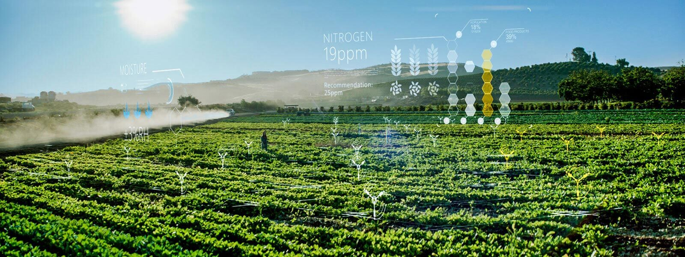

# Precision - Farming
A Decision For Future

## Members 
#### [Aashraya Katiyar](https://github.com/Aashray446)
#### [Akshaj.S.R](https://github.com/Akshaj000)
#### Sai Sumitha
#### B Nandhana 
#### [Ronak Dudhani](https://github.com/ronakdudhani)
#### [Nikhil](https://github.com/NikhilSingh433)

## Introduction

 Agriculture is the science, art, or practice of cultivating the
soil, producing crops, and raising livestock and in varying
degrees the preparation and marketing of the resulting
products. Finding the best crop for the farmer based on the soil nutrients is a
small part of the problems that we focused on this project. The
solution that we approached is to use different
machine learning model to predict the best crop which can be
cultivated under the given conditions. 

## Algorithm Used
##### Naive Bayes
##### Decision Tree
##### Random Forest

## Project Structure

| Files & Folders | Description |
| ------------- |:-------------:|
| Custom Naive Bayes       | Contains Implementation of custom Naive Bayes Algrothim     |
| Notes                    | Contains some related resources to learn     |
| croprecommender.py       | Main Program that contains UI     |
| CropRecommendation.iyp   | Contains the logics , data analysis and implementation of all three algorithm i.e Naiv Bayes, Decision tree and RandomForest     |
| Crop_recommendation.csv       | Our Dataset |

